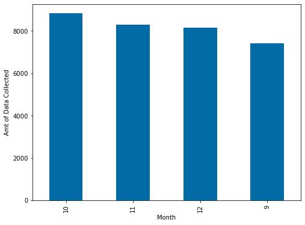
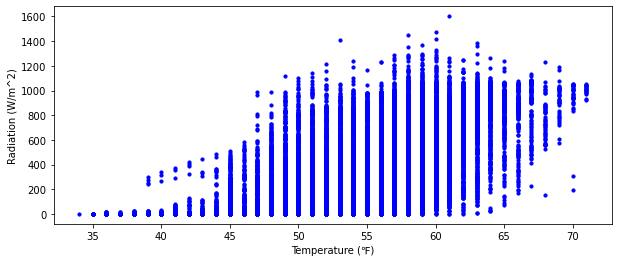
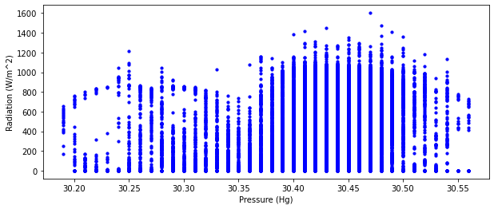

# APP ON SOLAR PREDICTION DATASET

This dataset originally use for the prediction of solar radiation. The data was collected within September through December of 2016. However in this work project, we will be looking at:
1. At what time of the day during these four months, that the radiation is strong or measured in high value?
2. At what time of the day during these four months, that the radiation is at the lowest value?


3. Plotting:
    - Amount of data collected for each month
    - The relationship betweens:
       - An occurrence of Temperature vs Radiation
       - An occurrence of Pressure vs Radiation
      
      
4. User input functions:
   - Temperature conversion
   - Determination of Wind Directions
   
Below are the data dictionary which stated the units of each data columns:
- Solar radiation: W/m2 (Watts per meter^2)
- Temperature: ℉ (Degrees Fahrenheit)
- Barometric pressure: Hg
- Humidity: %
- Wind direction: Degrees
- Wind speed: MPH (Miles per hour)
- Sunrise/sunset: GMT-10 (Hawaii time)

## Step 1:
### Importing pandas, numpy, matplotlib.pyplot, datetime, seaborn


```python
import pandas as pd
import numpy as np
import matplotlib.pyplot as plt
import seaborn as sb
from datetime import datetime

#set the plot to be display in the Jupyter Notebook
%matplotlib inline

# Use to change the color of the plot
plt.style.use('tableau-colorblind10')

# Set the figure and font size of the plot
plt.rcParams['figure.figsize'] = (8, 6)
plt.rcParams['font.size'] = 10
```

## Step 2:
### Load the dataset into Jupyter Notebook and extracting the basic information of the dataset:


```python
# Read the csv file
solar_rad = pd.read_csv("../data/SolarPrediction.csv")

# Show first 5 dataframe
solar_rad.head()
```


<div>
<style scoped>
    .dataframe tbody tr th:only-of-type {
        vertical-align: middle;
    }

    .dataframe tbody tr th {
        vertical-align: top;
    }

    .dataframe thead th {
        text-align: right;
    }
</style>
<table border="1" class="dataframe">
  <thead>
    <tr style="text-align: right;">
      <th></th>
      <th>UNIXTime</th>
      <th>Data</th>
      <th>Time</th>
      <th>Radiation</th>
      <th>Temperature</th>
      <th>Pressure</th>
      <th>Humidity</th>
      <th>WindDirection(Degrees)</th>
      <th>Speed</th>
      <th>TimeSunRise</th>
      <th>TimeSunSet</th>
    </tr>
  </thead>
  <tbody>
    <tr>
      <th>0</th>
      <td>1475229326</td>
      <td>9/29/2016 12:00:00 AM</td>
      <td>23:55:26</td>
      <td>1.21</td>
      <td>48</td>
      <td>30.46</td>
      <td>59</td>
      <td>177.39</td>
      <td>5.62</td>
      <td>06:13:00</td>
      <td>18:13:00</td>
    </tr>
    <tr>
      <th>1</th>
      <td>1475229023</td>
      <td>9/29/2016 12:00:00 AM</td>
      <td>23:50:23</td>
      <td>1.21</td>
      <td>48</td>
      <td>30.46</td>
      <td>58</td>
      <td>176.78</td>
      <td>3.37</td>
      <td>06:13:00</td>
      <td>18:13:00</td>
    </tr>
    <tr>
      <th>2</th>
      <td>1475228726</td>
      <td>9/29/2016 12:00:00 AM</td>
      <td>23:45:26</td>
      <td>1.23</td>
      <td>48</td>
      <td>30.46</td>
      <td>57</td>
      <td>158.75</td>
      <td>3.37</td>
      <td>06:13:00</td>
      <td>18:13:00</td>
    </tr>
    <tr>
      <th>3</th>
      <td>1475228421</td>
      <td>9/29/2016 12:00:00 AM</td>
      <td>23:40:21</td>
      <td>1.21</td>
      <td>48</td>
      <td>30.46</td>
      <td>60</td>
      <td>137.71</td>
      <td>3.37</td>
      <td>06:13:00</td>
      <td>18:13:00</td>
    </tr>
    <tr>
      <th>4</th>
      <td>1475228124</td>
      <td>9/29/2016 12:00:00 AM</td>
      <td>23:35:24</td>
      <td>1.17</td>
      <td>48</td>
      <td>30.46</td>
      <td>62</td>
      <td>104.95</td>
      <td>5.62</td>
      <td>06:13:00</td>
      <td>18:13:00</td>
    </tr>
  </tbody>
</table>
</div>


```python
# checking the shape of the data: rows and columns
solar_rad.shape
```


    (32686, 11)


```python
# checking type of every columns of the data
# output: int64, float64, object == string
solar_rad.dtypes
```


    UNIXTime                    int64
    Data                       object
    Time                       object
    Radiation                 float64
    Temperature                 int64
    Pressure                  float64
    Humidity                    int64
    WindDirection(Degrees)    float64
    Speed                     float64
    TimeSunRise                object
    TimeSunSet                 object
    dtype: object


```python
# checking if the dataframe contain any null
solar_rad.info()
```

    <class 'pandas.core.frame.DataFrame'>
    RangeIndex: 32686 entries, 0 to 32685
    Data columns (total 11 columns):
     #   Column                  Non-Null Count  Dtype  
    ---  ------                  --------------  -----  
     0   UNIXTime                32686 non-null  int64  
     1   Data                    32686 non-null  object 
     2   Time                    32686 non-null  object 
     3   Radiation               32686 non-null  float64
     4   Temperature             32686 non-null  int64  
     5   Pressure                32686 non-null  float64
     6   Humidity                32686 non-null  int64  
     7   WindDirection(Degrees)  32686 non-null  float64
     8   Speed                   32686 non-null  float64
     9   TimeSunRise             32686 non-null  object 
     10  TimeSunSet              32686 non-null  object 
    dtypes: float64(4), int64(3), object(4)
    memory usage: 2.7+ MB
    


```python
# Reset the index
solar_rad.set_index('UNIXTime', inplace=True)
```


```python
solar_rad.head()
```


<div>
<style scoped>
    .dataframe tbody tr th:only-of-type {
        vertical-align: middle;
    }

    .dataframe tbody tr th {
        vertical-align: top;
    }

    .dataframe thead th {
        text-align: right;
    }
</style>
<table border="1" class="dataframe">
  <thead>
    <tr style="text-align: right;">
      <th></th>
      <th>Data</th>
      <th>Time</th>
      <th>Radiation</th>
      <th>Temperature</th>
      <th>Pressure</th>
      <th>Humidity</th>
      <th>WindDirection(Degrees)</th>
      <th>Speed</th>
      <th>TimeSunRise</th>
      <th>TimeSunSet</th>
    </tr>
    <tr>
      <th>UNIXTime</th>
      <th></th>
      <th></th>
      <th></th>
      <th></th>
      <th></th>
      <th></th>
      <th></th>
      <th></th>
      <th></th>
      <th></th>
    </tr>
  </thead>
  <tbody>
    <tr>
      <th>1475229326</th>
      <td>9/29/2016 12:00:00 AM</td>
      <td>23:55:26</td>
      <td>1.21</td>
      <td>48</td>
      <td>30.46</td>
      <td>59</td>
      <td>177.39</td>
      <td>5.62</td>
      <td>06:13:00</td>
      <td>18:13:00</td>
    </tr>
    <tr>
      <th>1475229023</th>
      <td>9/29/2016 12:00:00 AM</td>
      <td>23:50:23</td>
      <td>1.21</td>
      <td>48</td>
      <td>30.46</td>
      <td>58</td>
      <td>176.78</td>
      <td>3.37</td>
      <td>06:13:00</td>
      <td>18:13:00</td>
    </tr>
    <tr>
      <th>1475228726</th>
      <td>9/29/2016 12:00:00 AM</td>
      <td>23:45:26</td>
      <td>1.23</td>
      <td>48</td>
      <td>30.46</td>
      <td>57</td>
      <td>158.75</td>
      <td>3.37</td>
      <td>06:13:00</td>
      <td>18:13:00</td>
    </tr>
    <tr>
      <th>1475228421</th>
      <td>9/29/2016 12:00:00 AM</td>
      <td>23:40:21</td>
      <td>1.21</td>
      <td>48</td>
      <td>30.46</td>
      <td>60</td>
      <td>137.71</td>
      <td>3.37</td>
      <td>06:13:00</td>
      <td>18:13:00</td>
    </tr>
    <tr>
      <th>1475228124</th>
      <td>9/29/2016 12:00:00 AM</td>
      <td>23:35:24</td>
      <td>1.17</td>
      <td>48</td>
      <td>30.46</td>
      <td>62</td>
      <td>104.95</td>
      <td>5.62</td>
      <td>06:13:00</td>
      <td>18:13:00</td>
    </tr>
  </tbody>
</table>
</div>


```python
# Rename the columns
solar_rad.rename(columns={'Radiation':'Radiation (W/m^2)', 'Temperature':'Temperature (℉)','Humidity':'Humidity (%)', 'Pressure':'Pressure (Hg)', 'WindDirection(Degrees)':'WindDirection (Degrees)', 'Speed':'WindSpeed (mph)'}, inplace=True)
solar_rad.head()
```


<div>
<style scoped>
    .dataframe tbody tr th:only-of-type {
        vertical-align: middle;
    }

    .dataframe tbody tr th {
        vertical-align: top;
    }

    .dataframe thead th {
        text-align: right;
    }
</style>
<table border="1" class="dataframe">
  <thead>
    <tr style="text-align: right;">
      <th></th>
      <th>Data</th>
      <th>Time</th>
      <th>Radiation (W/m^2)</th>
      <th>Temperature (℉)</th>
      <th>Pressure (Hg)</th>
      <th>Humidity (%)</th>
      <th>WindDirection (Degrees)</th>
      <th>WindSpeed (mph)</th>
      <th>TimeSunRise</th>
      <th>TimeSunSet</th>
    </tr>
    <tr>
      <th>UNIXTime</th>
      <th></th>
      <th></th>
      <th></th>
      <th></th>
      <th></th>
      <th></th>
      <th></th>
      <th></th>
      <th></th>
      <th></th>
    </tr>
  </thead>
  <tbody>
    <tr>
      <th>1475229326</th>
      <td>9/29/2016 12:00:00 AM</td>
      <td>23:55:26</td>
      <td>1.21</td>
      <td>48</td>
      <td>30.46</td>
      <td>59</td>
      <td>177.39</td>
      <td>5.62</td>
      <td>06:13:00</td>
      <td>18:13:00</td>
    </tr>
    <tr>
      <th>1475229023</th>
      <td>9/29/2016 12:00:00 AM</td>
      <td>23:50:23</td>
      <td>1.21</td>
      <td>48</td>
      <td>30.46</td>
      <td>58</td>
      <td>176.78</td>
      <td>3.37</td>
      <td>06:13:00</td>
      <td>18:13:00</td>
    </tr>
    <tr>
      <th>1475228726</th>
      <td>9/29/2016 12:00:00 AM</td>
      <td>23:45:26</td>
      <td>1.23</td>
      <td>48</td>
      <td>30.46</td>
      <td>57</td>
      <td>158.75</td>
      <td>3.37</td>
      <td>06:13:00</td>
      <td>18:13:00</td>
    </tr>
    <tr>
      <th>1475228421</th>
      <td>9/29/2016 12:00:00 AM</td>
      <td>23:40:21</td>
      <td>1.21</td>
      <td>48</td>
      <td>30.46</td>
      <td>60</td>
      <td>137.71</td>
      <td>3.37</td>
      <td>06:13:00</td>
      <td>18:13:00</td>
    </tr>
    <tr>
      <th>1475228124</th>
      <td>9/29/2016 12:00:00 AM</td>
      <td>23:35:24</td>
      <td>1.17</td>
      <td>48</td>
      <td>30.46</td>
      <td>62</td>
      <td>104.95</td>
      <td>5.62</td>
      <td>06:13:00</td>
      <td>18:13:00</td>
    </tr>
  </tbody>
</table>
</div>


## Step 3: Determine the maximum and minimum of radiation values
### 1: At what time of the day during these four months, that the radiation is strong or measured in high value? and what is the respectives temperature, pressure and humidity.


```python
solar_rad[['Data', 'Time', 'Radiation (W/m^2)', 'Temperature (℉)', 'Pressure (Hg)', 'Humidity (%)']].groupby(by=['Time', 'Data']).max().sort_values('Radiation (W/m^2)', ascending=False).head(1)
```


<div>
<style scoped>
    .dataframe tbody tr th:only-of-type {
        vertical-align: middle;
    }

    .dataframe tbody tr th {
        vertical-align: top;
    }

    .dataframe thead th {
        text-align: right;
    }
</style>
<table border="1" class="dataframe">
  <thead>
    <tr style="text-align: right;">
      <th></th>
      <th></th>
      <th>Radiation (W/m^2)</th>
      <th>Temperature (℉)</th>
      <th>Pressure (Hg)</th>
      <th>Humidity (%)</th>
    </tr>
    <tr>
      <th>Time</th>
      <th>Data</th>
      <th></th>
      <th></th>
      <th></th>
      <th></th>
    </tr>
  </thead>
  <tbody>
    <tr>
      <th>12:15:04</th>
      <th>9/4/2016 12:00:00 AM</th>
      <td>1601.26</td>
      <td>61</td>
      <td>30.47</td>
      <td>93</td>
    </tr>
  </tbody>
</table>
</div>


### 2: At what time of the day during these four months, that the radiation is at lowest value? and what is the respectives temperature, pressure and humidity.


```python
solar_rad[['Data', 'Time', 'Radiation (W/m^2)', 'Temperature (℉)', 'Pressure (Hg)', 'Humidity (%)']].groupby(by=['Time', 'Data']).min().sort_values('Radiation (W/m^2)').head(1)
```


<div>
<style scoped>
    .dataframe tbody tr th:only-of-type {
        vertical-align: middle;
    }

    .dataframe tbody tr th {
        vertical-align: top;
    }

    .dataframe thead th {
        text-align: right;
    }
</style>
<table border="1" class="dataframe">
  <thead>
    <tr style="text-align: right;">
      <th></th>
      <th></th>
      <th>Radiation (W/m^2)</th>
      <th>Temperature (℉)</th>
      <th>Pressure (Hg)</th>
      <th>Humidity (%)</th>
    </tr>
    <tr>
      <th>Time</th>
      <th>Data</th>
      <th></th>
      <th></th>
      <th></th>
      <th></th>
    </tr>
  </thead>
  <tbody>
    <tr>
      <th>02:50:49</th>
      <th>12/29/2016 12:00:00 AM</th>
      <td>1.11</td>
      <td>37</td>
      <td>30.35</td>
      <td>54</td>
    </tr>
  </tbody>
</table>
</div>


## Step 4:
### Show how many data is collected for each months: plot


```python
# Add a new column name "Month"
solar_rad['Month'] = pd.to_datetime(solar_rad['Data']).dt.month
```


```python
# Check is the new column succesfull created or not
solar_rad.head(3)
```


<div>
<style scoped>
    .dataframe tbody tr th:only-of-type {
        vertical-align: middle;
    }

    .dataframe tbody tr th {
        vertical-align: top;
    }

    .dataframe thead th {
        text-align: right;
    }
</style>
<table border="1" class="dataframe">
  <thead>
    <tr style="text-align: right;">
      <th></th>
      <th>Data</th>
      <th>Time</th>
      <th>Radiation (W/m^2)</th>
      <th>Temperature (℉)</th>
      <th>Pressure (Hg)</th>
      <th>Humidity (%)</th>
      <th>WindDirection (Degrees)</th>
      <th>WindSpeed (mph)</th>
      <th>TimeSunRise</th>
      <th>TimeSunSet</th>
      <th>Month</th>
    </tr>
    <tr>
      <th>UNIXTime</th>
      <th></th>
      <th></th>
      <th></th>
      <th></th>
      <th></th>
      <th></th>
      <th></th>
      <th></th>
      <th></th>
      <th></th>
      <th></th>
    </tr>
  </thead>
  <tbody>
    <tr>
      <th>1475229326</th>
      <td>9/29/2016 12:00:00 AM</td>
      <td>23:55:26</td>
      <td>1.21</td>
      <td>48</td>
      <td>30.46</td>
      <td>59</td>
      <td>177.39</td>
      <td>5.62</td>
      <td>06:13:00</td>
      <td>18:13:00</td>
      <td>9</td>
    </tr>
    <tr>
      <th>1475229023</th>
      <td>9/29/2016 12:00:00 AM</td>
      <td>23:50:23</td>
      <td>1.21</td>
      <td>48</td>
      <td>30.46</td>
      <td>58</td>
      <td>176.78</td>
      <td>3.37</td>
      <td>06:13:00</td>
      <td>18:13:00</td>
      <td>9</td>
    </tr>
    <tr>
      <th>1475228726</th>
      <td>9/29/2016 12:00:00 AM</td>
      <td>23:45:26</td>
      <td>1.23</td>
      <td>48</td>
      <td>30.46</td>
      <td>57</td>
      <td>158.75</td>
      <td>3.37</td>
      <td>06:13:00</td>
      <td>18:13:00</td>
      <td>9</td>
    </tr>
  </tbody>
</table>
</div>


### 3. Plotting
#### - Amount of data collected for each month


```python
# showing data collection of each month
plt.style.use('tableau-colorblind10')
solar_rad['Month'].value_counts().plot(kind='bar');
plt.xlabel('Month')
plt.ylabel('Amt of Data Collected')
solar_rad['Month'].value_counts()
```


    10    8821
    11    8284
    12    8164
    9     7417
    Name: Month, dtype: int64


    

    


#### - An occurrence of Temperature vs Radiation


```python
solar_rad.plot(kind='scatter', x='Temperature (℉)', y='Radiation (W/m^2)', \
               color='blue', figsize=(10,4), s=10, alpha=1)
```


    <AxesSubplot:xlabel='Temperature (℉)', ylabel='Radiation (W/m^2)'>


    

    


#### - An occurrence of Pressure vs Radiation


```python
solar_rad.plot(kind='scatter', x='Pressure (Hg)', y='Radiation (W/m^2)', \
               color='blue', figsize=(10,4), s=10, alpha=1)
```


    <AxesSubplot:xlabel='Pressure (Hg)', ylabel='Radiation (W/m^2)'>


    

    


### 4: User Input Functions


```python
class Solar_info:
    
    def __init__(self, date = solar_rad['Data']):
        self.date = date
    
    def temp_conversion():   #any temp user enter that == temp in dataframe, convert to celcius
        while True:
            try:
                temp_input = int(input('Enter the °F temperature to convert to °C:'))

                for each_temp in (solar_rad['Temperature (℉)']):
                    if temp_input == each_temp:
                        temp_in_celcius = (temp_input-32)*(5/9)
                        print('The Fahrenheit temperature of {}°F, is {:.2f}°C in Degree Celcius'.format(temp_input,temp_in_celcius))
                        return

            except Exception as ex:
                print("The temperature format is incorrect: {}".format(ex.args))
                continue
                
                
    def wind_direction():  #any value of wind in term of degree, found in dataframe, give user wind direction
        
        while True:
            try:
                direction_input = float(input('Enter the wind value:'))
                
                for each_wind in solar_rad['WindDirection (Degrees)']:
                    
                    if direction_input >= 350 and direction_input < 20:                 #statement 1
                        print('The wind direction is {}°N'.format(direction_input))
                        return

                    if direction_input >= 20 and direction_input < 40:                 #statement 2
                        print('The wind direction is N{}°NE'.format(direction_input))
                        return

                    if direction_input >= 40 and direction_input < 60:                 #statement 3
                        print('The wind direction is {}°NE'.format(direction_input))
                        return
                        
                    if direction_input >= 60 and direction_input < 80:                 #statement 4
                        print('The wind direction is E{}°NE'.format(direction_input))
                        return

                    if direction_input >= 80 and direction_input < 110:                 #statement 5
                        print('The wind direction is {}°E'.format(direction_input))
                        return

                    if direction_input >= 110 and direction_input < 130:                 #statement 6
                        print('The wind direction is E{}°SE'.format(direction_input))
                        return

                    if direction_input >= 130 and direction_input < 150:                 #statement 7
                        print('The wind direction is {}°SE'.format(direction_input))
                        return

                    if direction_input >= 150 and direction_input < 170:                 #statement 8
                        print('The wind direction is S{}°SE'.format(direction_input))
                        return

                    if direction_input >= 170 and direction_input < 200:                 #statement 9
                        print('The wind direction is {}°S'.format(direction_input))
                        return

                    if direction_input >= 200 and direction_input < 220:                 #statement 10
                        print('The wind direction is S{}°SW'.format(direction_input))
                        return

                    if direction_input >= 220 and direction_input < 240:                 #statement 11
                        print('The wind direction is {}°SW'.format(direction_input))
                        return

                    if direction_input >= 240 and direction_input < 260:                 #statement 12
                        print('The wind direction is W{}°SW'.format(direction_input))
                        return

                    if direction_input >= 260 and direction_input < 290:                 #statement 13
                        print('The wind direction is {}°W'.format(direction_input))
                        return

                    if direction_input >= 290 and direction_input < 310:                 #statement 14
                        print('The wind direction is W{}°NW'.format(direction_input))
                        return

                    if direction_input >= 310 and direction_input < 330:                 #statement 15
                        print('The wind direction is {}°NW'.format(direction_input))
                        return

                    if direction_input >= 330 and direction_input < 350:                 #statement 16
                        print('The wind direction is N{}°NW'.format(direction_input))
                        return

            except Exception as ex:
                print("There is an error: {}".format(ex.args))
                continue
                
```


```python
Solar_info.temp_conversion()
```

    Enter the °F temperature to convert to °C:63
    The Fahrenheit temperature of 63°F, is 17.22°C in Degree Celcius
    


```python
Solar_info.wind_direction()
```

    Enter the wind value:53
    The wind direction is 53.0°NE
    

## Future Code Recommendation
- Create input user function:
  - Access data with 2 columns and return other data:
      - Get 2 input from the user: date and time from the columns
      - if date and time match in any row, 
      - return to user the temperature or radiation or humidity or any kind of information from the respective columns
  - Function that can plot info given by user:
      - User type 'Average of Temperature'
      - function return Average of temperature in term of plot/graph

- Create plot of Wind Direction and Wind Speed. 
  - use wind Rose plot type: 
  - Reference: *image was taken from google
  


##### Nurfarah binti Jaafar
